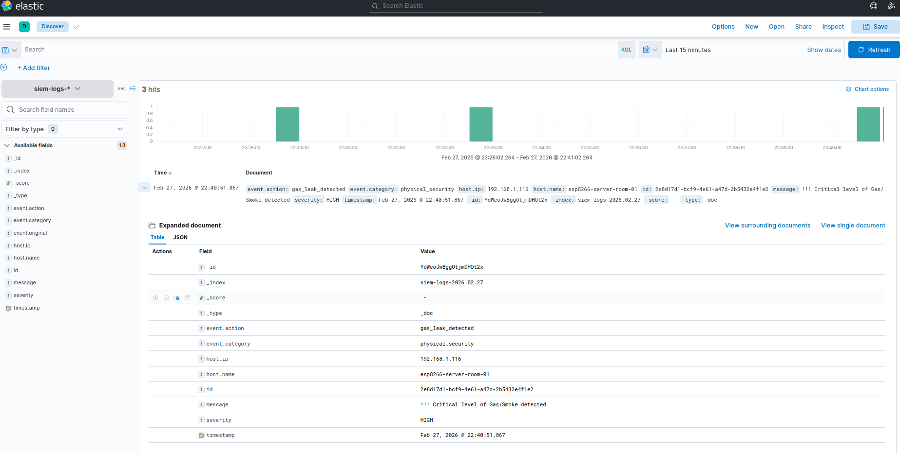

# 🛡️ LightSIEM Core & IoT Security Agent

## 📖 Overview

**LightSIEM** is a lightweight, highly scalable Security Information and Event Management (SIEM) backend integrated with physical IoT security agents. Built with a modern Python microservices architecture, it collects, parses, normalizes, and analyzes logs from various endpoints (Web, EDR, and Physical Sensors) in real-time.

Unlike traditional software-only SIEMs, this project bridges the gap between **Cybersecurity and Physical Security (IoT)** by incorporating an ESP8266-based hardware agent that monitors server room conditions (Gas/Smoke and Temperature anomalies).

## ✨ Key Features

* **🚀 High-Performance API:** Asynchronous log ingestion powered by FastAPI and Pydantic data validation.
* **🧠 Smart Rule Engine:** Modular detection engine capable of identifying:
  * WAF Alerts & Web Attacks
  * EDR Events (e.g., Reverse shell attempts like `nc -e`)
  * Brute Force Login Attempts
* **🔌 IoT Physical Security Agent:** Custom C++ firmware for NodeMCU (ESP8266) integrating MQ-2 (Gas/Smoke) and DHT11 (Temperature/Humidity) sensors to monitor data center physical integrity.
* **📱 Real-Time Alerting:** Instant push notifications via Telegram API for `HIGH` and `CRITICAL` severity events.
* **📊 Data Lake Integration:** Direct, real-time indexing of normalized logs into **Elasticsearch** for hunting and visualization in **Kibana**.

## 🏗️ Architecture Design

1. **Endpoints (Data Sources):** Linux EDR agents, Web Firewalls, and ESP8266 Physical Sensors generate JSON payloads.
2. **Ingestion Layer (FastAPI):** Receives the payload at `/api/v1/ingest`.
3. **Normalization (Log Parser):** Validates and normalizes raw data into a standard ECS-like format.
4. **Detection Engine:** Evaluates the normalized log against modular security rules.
5. **Action & Storage:** Triggers Telegram alerts for critical threats and routes the normalized data to Elasticsearch for persistent storage.

## 🗂️ Project Structure

    siem-project/
    ├── agents/
    │   ├── esp32/
    │   ├── linux/
    │   └── waf/
    ├── backend/
    ├── src/
    │   ├── api/
    │   │   └── routes.py
    │   ├── models.py
    │   ├── normalization/
    │   │   └── parser.py
    │   ├── detection/
    │   │   ├── rule_engine.py
    │   │   ├── brute_force.py
    │   │   ├── endpoint_detect.py
    │   │   └── web_attacks.py
    │   ├── notification/
    │   │   └── telegram.py
    │   └── storage/
    │       └── elastic_client.py
    ├── tests/
    ├── infrastructure/
    │   └── docker/
    │       └── docker-compose.yml
    ├── requirements.txt
    ├── README.md
    └── .gitignore

## 🔌 Hardware Setup (ESP8266 IoT Agent)

Below is the wiring schematic for the NodeMCU V2 (ESP8266) Physical Security Agent:

    +-------------------------------------------+
    |               NodeMCU V2 (ESP8266)        |
    |                                           |
    |  [Vin] <----------------+--- [5V VCC]     |
    |                         |                 |
    |  [GND] <------------+---+--- [GND]        |
    |                     |   |                 |
    |  [D1] (GPIO 5) <----+   |--- [D0 (Data)]  |
    |                         |                 | MQ-2
    |                         |                 | Sensor
    |                         +-----------------+
    |                                           |
    |  [3V3] <-------------------- [VCC]        |
    |                                           |
    |  [GND] <-------------------- [GND]        |
    |                                           |
    |  [D2] (GPIO 4) <------------ [DATA]       |
    |                                           | DHT11
    |                                           | Sensor
    |                                           |
    +-------------------------------------------+

## 🛠️ Technology Stack

* **Backend:** Python, FastAPI, Uvicorn, Pydantic
* **Storage & Visuals:** Elasticsearch, Kibana, Docker Compose
* **Hardware / IoT:** NodeMCU V2 (ESP8266), C++ (Arduino IDE), MQ-2, DHT11
* **Alerting:** Telegram Bot API

## 🚀 Getting Started

### 1. Start the Backend Infrastructure

Navigate to the docker directory and spin up the backend along with the Elastic Stack:

    cd infrastructure/docker/
    docker compose up -d

### 2. Configure Telegram Alerts

Ensure you have added your Telegram Bot Token and Chat ID to the `.env` file or environment variables to receive real-time alerts.

### 3. Deploy the IoT Agent

Flash the provided C++ firmware (`esp8266_agent.ino`) onto your NodeMCU V2. Connect the MQ-2 sensor to D1 and the DHT11 sensor to D2. Ensure the device is connected to the same local network as the SIEM backend.

### 4. Access Kibana Dashboard

Once the infrastructure is up and running, you can access the Kibana SIEM interface to monitor your logs and view the dashboards.

Open your web browser and navigate to:
`http://localhost:5601`

*(Note: The default Kibana port is 5601. If you configured a different port, adjust the URL accordingly.)*

## 📸 Screenshots

* **Kibana Main Dashboard:** Event distributions and pie charts.
  

* **Real-Time IoT Alert:** Physical security log ingestion (Gas/Smoke detected).
  

## 🤝 Contributing

Developed by **m3rg3n**. This project is a continuous effort to build a unified defensive architecture against both digital and physical threats.